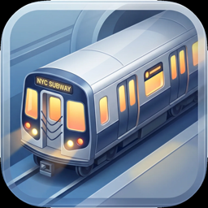
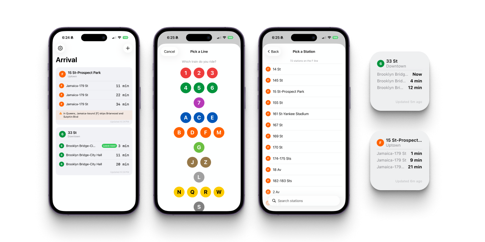

<p align="center">
  
</p>
<h1 align="center">Arrival for iOS</h1>
<p align="center">Real-time NYC subway arrivals on your iPhone.<br>
Never miss your train.</p>
<p align="center"><strong>Version 1.0.0</strong> · iOS 17+</p>
<p align="center">Also available for <a href="https://github.com/madebysan/arrival"><strong>macOS</strong></a></p>

---

<p align="center">
  
</p>

## What it does

Arrival shows real-time subway arrivals for your saved stations — right on your iPhone and home screen widget.

- **Next trains** with live countdowns that update every 60 seconds
- **Service alerts** for your line (delays, planned work)
- **"Leave now!"** indicator based on your walking time to the station
- **Home screen widgets** — small and medium sizes with configurable stop picker

Data comes directly from the MTA's free GTFS-Realtime feeds — the same source that powers the countdown clocks in stations.

## Features

- **Every NYC subway line** — 1/2/3, 4/5/6, 7, A/C/E, B/D/F/M, G, J/Z, L, N/Q/R/W, S
- **All ~496 stations** — searchable picker, filtered by line
- **Up to 4 saved stops** — track multiple stations and directions
- **Home screen widgets** — small (3 arrivals) and medium (3 arrivals + leave now badge) sizes
- **Widget stop picker** — choose which saved stop each widget displays
- **Auto-refresh** — arrival data refreshes every 60 seconds while the app is open
- **Walking time** — set how many minutes you are from each station; trains you can still catch are highlighted
- **Service alerts** — live delay and planned work notifications for your lines
- **Native SwiftUI** — lightweight, follows system dark/light mode

## Setup

1. Open Arrival and tap **Add Stop**
2. Pick your subway line → direction → station
3. Set your walking time (optional)
4. Add a home screen widget: long-press home screen → "+" → search "Arrival"
5. Long-press the widget → Edit to pick which stop it displays

## Build from source

```bash
git clone https://github.com/madebysan/arrival-ios.git
cd arrival-ios
open ArrivaliOS.xcodeproj
```

Build and run with Xcode 16+ targeting iOS 17+.

## Tech Stack

- Swift + SwiftUI
- WidgetKit + AppIntents (configurable home screen widgets)
- Apple swift-protobuf for GTFS-RT parsing
- MTA GTFS-Realtime feeds (free, no API key)
- Swift Package Manager

## Data Source

All train arrival data comes from the [MTA's GTFS-Realtime feeds](https://api.mta.info/), which are free and require no API key. The app fetches data on-demand and refreshes every 60 seconds while visible.

## Related

- [Arrival for macOS](https://github.com/madebysan/arrival) — menu bar version

## License

MIT — see [LICENSE](LICENSE)

---

Made by [santiagoalonso.com](https://santiagoalonso.com)
