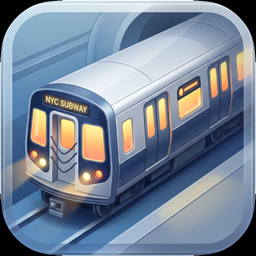
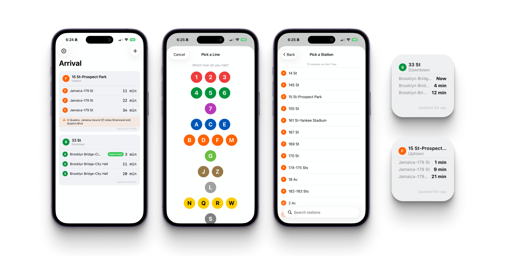

<p></p>

<h1>Arrival for iOS</h1>

<p>Real-time NYC subway arrivals on your iPhone.<br>
Never miss your train.</p>

<p><strong>Version 1.0.0</strong> · iOS 17+</p>

<p>
  
  
  
  
</p>

<p>
  <a href="https://apps.apple.com/us/app/arrival-nyc-subway/id6759941751"></a>
</p>

<p>Also available for <a href="https://github.com/madebysan/arrival">macOS</a></p>



I commute the same route every day. The only thing I actually need is when is the next train at my stop, on my line, going my direction. The home screen widget does most of the work. Glance at your phone, see the next three trains, walk out of your apartment if one is still catchable. When you need more detail, open the app for service alerts and longer countdowns.

## How it works

Save up to four stops (line, direction, station) and set your walking time. The app highlights which trains you can still catch and refreshes every 60 seconds while open. Widgets pull fresh data on the iOS refresh cadence.

To add a widget: long-press the home screen, tap **+**, search "Arrival". The small widget shows three upcoming arrivals. The medium shows three arrivals plus a "Leave now" badge. Long-press any widget and hit Edit to pick which saved stop it displays.

Data comes from the [MTA's free GTFS-Realtime feeds](https://api.mta.info/), the same source powering the countdown clocks in stations.

Arrival includes every subway line and roughly 496 stations. Save up to four stops, assign a different stop to each widget, and set the walking time separately for each route. Service alerts and countdowns update while the app is open; widgets refresh on the iOS schedule.

## Build from source

```bash
git clone https://github.com/madebysan/arrival-ios.git
cd arrival-ios
open ArrivaliOS.xcodeproj
```

Build and run with Xcode 16+ targeting iOS 17+. The shipped build is on the [App Store](https://apps.apple.com/us/app/arrival-nyc-subway/id6759941751).

## Tech stack

- Swift + SwiftUI
- WidgetKit + AppIntents (configurable home screen widgets)
- Apple `swift-protobuf` for GTFS-RT parsing
- MTA GTFS-Realtime feeds (free, no API key)
- Swift Package Manager

## License

[MIT](LICENSE)

Made by [santiagoalonso.com](https://santiagoalonso.com)
